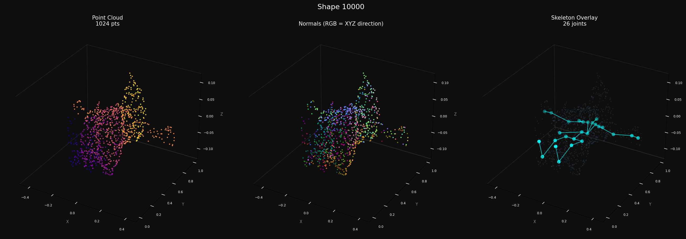

# Phase 1: Point Cloud Dataset Generation

## Overview


The [RigNet dataset](https://github.com/zhan-xu/RigNet) provides **2703 preprocessed 3D character models** with ground-truth rig data. In this phase, each model is converted into a **point cloud of 1024 points** with outward surface normals, plus skeleton and skinning arrays.

<div align="center">
  <table>
    <tr>
      <td align="center">
        
        <br />
        <strong>During Training</strong>
      </td>
      <td align="center">
        
        <br />
        <strong>After Training</strong>
      </td>
    </tr>
  </table>
</div>

Source: `Dataset/obj_remesh/` (remeshed OBJ meshes, 1K–5K verts each)  
Output: `pointClouds/obj_remesh/` (NPY arrays per shape)

---

## Running Phase 1

```bash
# Quick test
python dataset.py --max_shapes 5

# Full run (all 2703 shapes, resume-safe)
python dataset.py --split all --max_shapes 2703 --resume

# Specific split
python dataset.py --split train --resume
```

---

## Output Format

All files saved to `pointClouds/obj_remesh/`:

| File | Shape | Description |
|------|-------|-------------|
| `<id>_pointcloud.npy` | `[1024, 6]` | xyz + normals — main input to Phase 2 |
| `<id>_points.npy` | `[1024, 3]` | xyz positions |
| `<id>_normals.npy` | `[1024, 3]` | outward surface normals |
| `<id>_skeleton.npy` | `[K, 4]` | joint xyz + BFS parent index |
| `<id>_skinning.npy` | `[V, K]` | dense per-vertex skinning weights |

---

## Visualisation

Generated by `tests/phase1_test.py`. Three panels per shape:

| Panel | Description |
|-------|-------------|
| Left | Point cloud coloured by Y height |
| Middle | Normals mapped to RGB — each axis (X/Y/Z) maps to a colour channel |
| Right | Skeleton joints (cyan dots) + bones overlaid on the mesh |



> Re-generate with: `python tests/phase1_test.py --shape_id 10000`

---

## Code Walkthrough

### `parse_rig_info(sid)`

Parses `Dataset/rig_info_remesh/<id>.txt` — no Blender required.

```
joints pelvis 0.0 0.43 -0.02
root   pelvis
hier   pelvis L_hip
hier   pelvis R_hip
skin   0 pelvis 0.8 L_hip 0.2
```

Returns a dict with `joint_names`, `joint_pos`, `parents`, `skin_weights`. Joints are BFS-ordered from root so indices are stable.

---

### `sample_surface(mesh, N)`

Area-weighted barycentric sampling — larger triangles receive proportionally more points. Uses the `sqrt(r1)` correction for uniform distribution within each triangle. Normals pointing toward the mesh centroid are flipped to guarantee outward orientation.

Returns `pts [N, 3]` and `nrm [N, 3]`. Combined as `[N, 6]` — the primary Phase 2 input.

---

### `build_bfs(rig)`

Converts the skeleton tree into BFS order from the root. Each joint gets BFS index `k` with `parent_k < k` guaranteed. Saved as `[K, 4]`: `[x, y, z, parent_k]`.

---

### `dense_skin(rig, V)`

Converts sparse skinning weight dict into a dense `[V × K]` matrix. Each row is normalized so weights sum to 1.0 per vertex.
